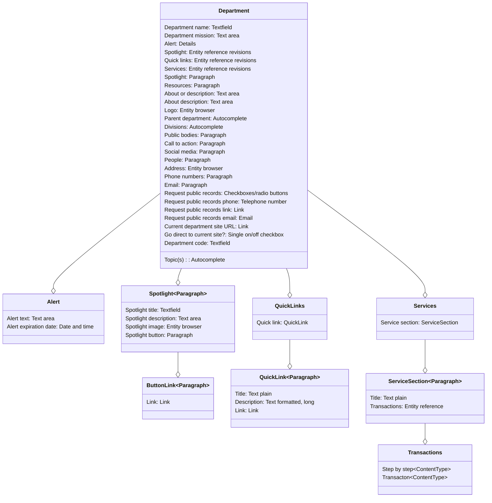

```mermaid
classDiagram
  class Department {
    Department name: Textfield
    Department mission: Text area
    Alert: Details
    Spotlight: Entity reference revisions
    Quick links: Entity reference revisions
    Services: Entity reference revisions
    Spotlight: Paragraph
    Resources: Paragraph
    About or description: Text area
    About description: Text area
    Logo: Entity browser
    Parent department: Autocomplete
    Divisions: Autocomplete
    Public bodies: Paragraph
    Call to action: Paragraph
    Social media: Paragraph
    People: Paragraph
    Address: Entity browser
    Phone numbers: Paragraph
    Email: Paragraph
    Request public records: Checkboxes/radio buttons
    Request public records phone: Telephone number
    Request public records link: Link
    Request public records email: Email
    Current department site URL: Link
    Go direct to current site?: Single on/off checkbox
    Department code: Textfield
    Topic(s): Autocomplete
  }
  class Alert {
    Alert text: Text area
    Alert expiration date: Date and time
  }
  class Spotlight~Paragraph~ {
    Spotlight title: Textfield
    Spotlight description: Text area
    Spotlight image: Entity browser
    Spotlight button: Paragraph
  }
  class ButtonLink~Paragraph~ {
    Link: Link
  }
  class QuickLinks {
    Quick link: QuickLink
  }
  class QuickLink~Paragraph~ {
    Title: Text plain
    Description: Text formatted, long
    Link: Link
  }
  class Services {
    Service section: ServiceSection
  }
  class ServiceSection~Paragraph~ {
    Title: Text plain
    Transactions: Entity reference
  }
  class Transactions {
    Step by step~ContentType~
    Transacton~ContentType~
  }
  Department --o Alert
  Department --o Spotlight
  Spotlight --o ButtonLink
  Department --o QuickLinks
  QuickLinks --o QuickLink
  Department --o Services
  Services --o ServiceSection
  ServiceSection --o Transactions
```
